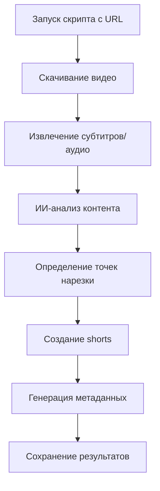

# Техническое задание: YouTube Shorts Creator

## 1. Обзор продукта
Python-скрипт для автоматического создания коротких роликов (shorts) из YouTube видео с использованием искусственного интеллекта для анализа контента и определения оптимальных моментов нарезки.

Продукт решает проблему создания качественного контента для социальных сетей путем автоматизации процесса нарезки длинных видео на короткие, содержательные фрагменты.

Целевая аудитория: контент-мейкеры, маркетологи, блогеры, которым необходимо быстро создавать shorts из существующего видеоконтента.

## 2. Основные функции

### 2.1 Пользовательские роли
Система не требует разделения ролей - предназначена для локального использования одним пользователем.

### 2.2 Функциональные модули
Наша система состоит из следующих основных компонентов:
1. **Модуль загрузки**: скачивание видео с YouTube по ссылке
2. **Модуль анализа**: извлечение и анализ контента (субтитры, метаданные, аудио)
3. **Модуль ИИ-обработки**: определение оптимальных моментов нарезки через ollama
4. **Модуль нарезки**: создание коротких роликов через ffmpeg
5. **Модуль генерации метаданных**: создание описаний и названий через ИИ
6. **Модуль логирования**: отслеживание всех операций

### 2.3 Детали страниц

| Компонент | Модуль | Описание функции |
|-----------|--------|------------------|
| Загрузка видео | YouTube Downloader | Скачивание видео по URL через yt-dlp, поддержка различных форматов и качества |
| Анализ контента | Content Analyzer | Извлечение субтитров, метаданных, анализ аудио через whisper для speech-to-text |
| ИИ-анализ | AI Context Processor | Обработка контента через ollama (llama3.2, mistral) для определения ключевых моментов |
| Интеллектуальная нарезка | Smart Segmentation | Создание логичных фрагментов до 60 секунд на основе ИИ-анализа |
| Обработка видео | Video Processing | Нарезка видео через ffmpeg с сохранением качества |
| Генерация метаданных | Metadata Generator | Создание названий, описаний, тегов для каждого shorts через ИИ |
| Управление файлами | File Management | Организация выходных файлов в структурированные папки |
| Логирование | Logging System | Детальное логирование всех операций с временными метками |

## 3. Основной процесс

Пользователь запускает скрипт с URL YouTube видео. Система последовательно выполняет:
1. Скачивание видео и извлечение метаданных
2. Анализ контента (субтитры, аудио) через whisper
3. ИИ-обработка для определения оптимальных точек нарезки
4. Создание коротких роликов через ffmpeg
5. Генерация метаданных для каждого shorts
6. Сохранение результатов в организованную структуру папок

## 4. Дизайн пользовательского интерфейса

### 4.1 Стиль дизайна
- **Интерфейс**: Консольное приложение с цветным выводом
- **Цвета**: Зеленый для успешных операций, красный для ошибок, синий для информации
- **Прогресс-бары**: ASCII-индикаторы прогресса для длительных операций
- **Логирование**: Структурированный вывод с временными метками
- **Иконки**: Эмодзи для визуального разделения этапов (📥 загрузка, 🤖 ИИ-анализ, ✂️ нарезка, 💾 сохранение)

### 4.2 Обзор интерфейса

| Компонент | Модуль | UI Элементы |
|-----------|--------|-------------|
| Запуск | Command Line | Аргументы командной строки, валидация URL, справочная информация |
| Прогресс | Progress Display | Цветные прогресс-бары, процентные индикаторы, ETA для операций |
| Логирование | Console Output | Структурированные сообщения с временными метками, уровни важности |
| Результаты | Results Summary | Таблица созданных файлов, статистика обработки, пути к выходным файлам |

### 4.3 Кроссплатформенность
Скрипт оптимизирован для работы на macOS и Windows с автоматическим определением операционной системы и адаптацией путей к файлам.