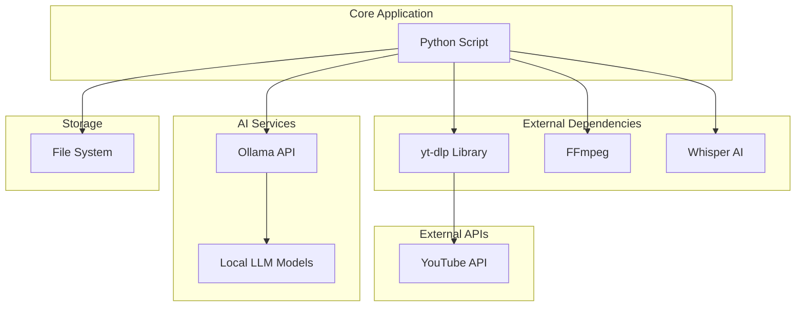
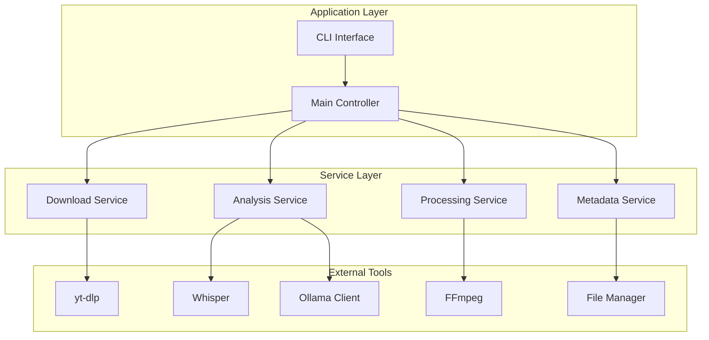
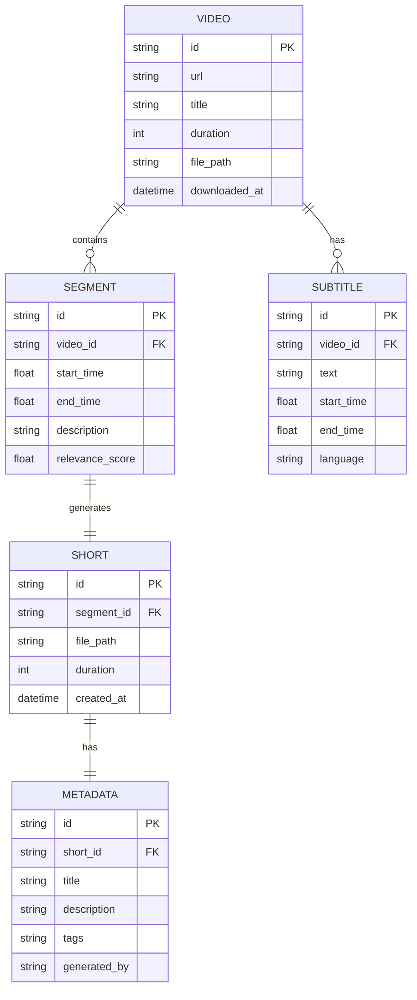

# Техническая архитектура: YouTube Shorts Creator

## 1. Архитектурный дизайн



## 2. Описание технологий

* Frontend: Консольное приложение Python 3.9+

* Backend: Локальные сервисы (yt-dlp, ffmpeg, whisper, ollama)

* AI: Ollama с локальными моделями (llama3.2, mistral, codellama)

* Обработка видео: FFmpeg

* Speech-to-Text: OpenAI Whisper

## 3. Определения маршрутов

| Компонент            | Назначение                                                 |
| -------------------- | ---------------------------------------------------------- |
| main()               | Главная точка входа, обработка аргументов командной строки |
| download\_video()    | Скачивание видео с YouTube через yt-dlp                    |
| extract\_content()   | Извлечение субтитров и аудио для анализа                   |
| analyze\_with\_ai()  | ИИ-анализ контента через ollama                            |
| create\_segments()   | Создание временных сегментов для нарезки                   |
| process\_video()     | Нарезка видео через ffmpeg                                 |
| generate\_metadata() | Генерация описаний через ИИ                                |

## 4. API определения

### 4.1 Основные API

#### Ollama API для анализа контента

```
POST http://localhost:11434/api/generate
```

Request:

| Параметр | Тип     | Обязательный | Описание                                  |
| -------- | ------- | ------------ | ----------------------------------------- |
| model    | string  | true         | Название модели (llama3.2, mistral)       |
| prompt   | string  | true         | Текст для анализа (субтитры + метаданные) |
| stream   | boolean | false        | Потоковый режим ответа                    |

Response:

| Параметр | Тип     | Описание                             |
| -------- | ------- | ------------------------------------ |
| response | string  | Анализ контента с временными метками |
| done     | boolean | Статус завершения                    |

Пример запроса:

```json
{
  "model": "llama3.2",
  "prompt": "Проанализируй следующие субтитры и определи 3-5 наиболее интересных моментов для создания 60-секундных shorts: [субтитры]",
  "stream": false
}
```

#### Whisper API для транскрипции

```
Python Function: whisper.transcribe()
```

Request:

| Параметр    | Тип    | Обязательный | Описание                              |
| ----------- | ------ | ------------ | ------------------------------------- |
| audio\_path | string | true         | Путь к аудиофайлу                     |
| model       | string | false        | Размер модели (base, small, medium)   |
| language    | string | false        | Язык аудио (auto-detect по умолчанию) |

Response:

| Параметр | Тип    | Описание                      |
| -------- | ------ | ----------------------------- |
| text     | string | Полный текст транскрипции     |
| segments | array  | Сегменты с временными метками |

## 5. Архитектурная диаграмма сервера



## 6. Модель данных

### 6.1 Определение модели данных



### 6.2 Структуры данных Python

#### Конфигурация проекта

```python
# Структура данных для видео
class VideoInfo:
    def __init__(self):
        self.id: str = ""
        self.url: str = ""
        self.title: str = ""
        self.duration: int = 0
        self.file_path: str = ""
        self.downloaded_at: datetime = None

# Структура для сегмента
class VideoSegment:
    def __init__(self):
        self.start_time: float = 0.0
        self.end_time: float = 0.0
        self.description: str = ""
        self.relevance_score: float = 0.0
        self.subtitle_text: str = ""

# Структура для метаданных shorts
class ShortMetadata:
    def __init__(self):
        self.title: str = ""
        self.description: str = ""
        self.tags: List[str] = []
        self.generated_by: str = "ollama"
        self.file_path: str = ""

# Конфигурация приложения
class Config:
    def __init__(self):
        self.output_dir: str = "./shorts_output"
        self.temp_dir: str = "./temp"
        self.max_short_duration: int = 60
        self.ollama_model: str = "llama3.2"
        self.whisper_model: str = "base"
        self.video_quality: str = "720p"
        self.log_level: str = "INFO"
```

#### Структура выходных файлов

```
shortsCreator/
├── main.py                 # Основной скрипт
├── requirements.txt        # Зависимости
├── README.md              # Инструкции по установке
├── config.json            # Конфигурация
├── logs/                  # Логи выполнения
│   └── shorts_creator.log
├── temp/                  # Временные файлы
│   ├── downloaded_video.mp4
│   └── extracted_audio.wav
└── output/                # Результаты
    ├── video_title/
    │   ├── short_001.mp4
    │   ├── short_002.mp4
    │   └── metadata/
    │       ├── short_001_meta.json
    │       └── short_002_meta.json
    └── processing_log.json
```

